# Image denoising using SVD, FFT and Wavelet transforms

## 1. Introduction

This project was created to compare the performance of different image denoising techniques. All the techniques were implemented in Python and for the frontend I used the [Shiny for Python](https://shiny.posit.co/py/) library which is a port of the R Shiny library. Most of the functionality of the Shiny package for Python is an exact copy of the R Shiny library, so if you are familiar with R Shiny you will have no problem using this library.

The differences between those two libraries are as follows:

- Decorators are used instead of functions
- Function names are used to connect outputs to the UI
- More precise namespaces
- All inputs are invoked with `input.<input_name>()`
- Some functions have different names
- No library for managing JavaScript so you have to write it yourself as of now

I used Shiny for Python because I wanted to create a web application that would be easy to use, neatly organized and look good out of the box. It was also a great choice because I wanted to enable users to upload their own images and adjust the parameters of the denoising algorithms.

On top of that, the libraries used to finalize the project are:

- [NumPy](https://numpy.org/) - for matrix operations and SVD decomposition
- [SciPy](https://www.scipy.org/) - for the FFT transform
- [shinyswatch](https://github.com/rstudio/py-shinyswatch) - for the UI theme
- [io](https://docs.python.org/3/library/io.html) - for downloading the image
- [imageio](https://imageio.readthedocs.io) - for reading and saving images
- [skimage](https://scikit-image.org/) - for the wavelet transform
- [PyWavelets](https://pywavelets.readthedocs.io/en/latest/) - for obtaining the wavelets names

## 2. Step by step guide

User is presented with a simple UI looking like this:

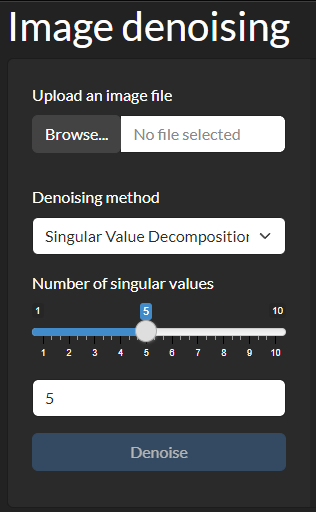

On the top there is an upload button which allows the user to upload an image of choice.
Below that we can see a select box with all the implemented denoising algorithms.
Selecting an algorithm will display the parameters that can be adjusted for that method. If we upload the image we can then try to denoise it using the selected algorithm.
The preview of the image is displayed on the right side of the screen. The user can also download the image by clicking the download button after the image has been denoised.

All the parameters that user can modify will be described in the sections dedicated to each algorithm.

## 3. Algorithms and their parameters

### 3.1. SVD

This denoising method is based on the Singular Value Decomposition of the image matrix.
The method in intself is very straightforward. We decompose the image matrix into three matrices: $U$, $S$ and $V$. As we already know, the $S$ matrix is a diagonal matrix with the singular values of the image matrix on the diagonal and the multiplication of the three matrices gives us the original image matrix.

Let's take a closer look at the singular values matrix. As an example we will use the image of man.

Plotted singular values of the image matrix:

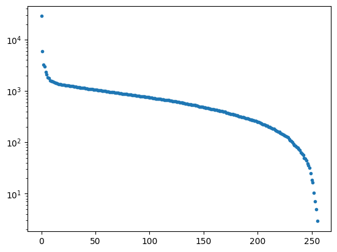

We can see that the singular values decay very fast. This means that we can approximate the original image matrix with a matrix that has only a few singular values. This is exactly what we do in the denoising algorithm. We take the singular values matrix and set all the values below a certain threshold to zero. Then we multiply the three matrices and we get the denoised image.

In the implementation of the algorithm the user can set the number of singular values that will be used to reconstruct the image. The higher the number, the better the quality of the image but also the less noise is removed. Based on the plot above we set the number of singular values we want to preserve to 20.

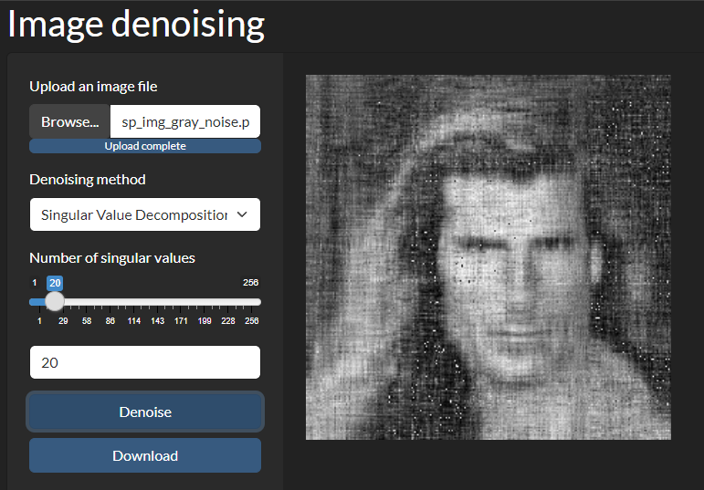

We can see that the image is denoised but there is still some noise left. We might decrease the number of singular values to 10.

Now the image is more denoised but we can see that the quality of the image is way worse. This is because we removed too many singular values that represent the image matrix.

Let's try two values in the range between the beginning and the end of slow decay of the singular values.

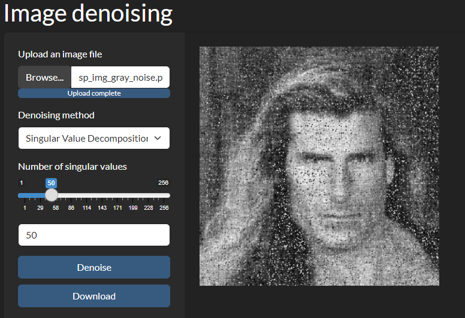

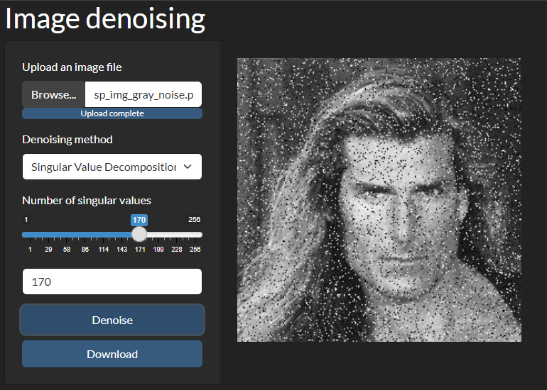

As we can clearly see there is not much of a difference between the two images. So we can conclude that preserving the values up to the beginning of the slow decay of the singular values is the best choice that maximizes the denoising effect and preserves decent quality of the image.

### 3.2. FFT

The second method we will look at is the Fast Fourier Transform. Since noise, edge, and texture are high frequency components, it is difficult to distinguish them in the process of denoising and the denoised images could inevitably lose some details.

Initially we convert the image into the frequency domain using the FFT transform.

As an example we use the same man image as before.

Let's take a look at the magnitude of the FFT transform of the image.

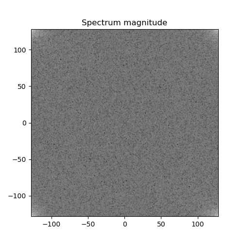

We see some high power of frequencies in the image represented by the white color.
The corners in the spectrum image are the low frequency components. So we can see there is high energy in the low frequency components which is a normal situation for most images. We shift the spectrum so that the low frequency components are in the center of the image as it is easier to visualize the spectrum this way.

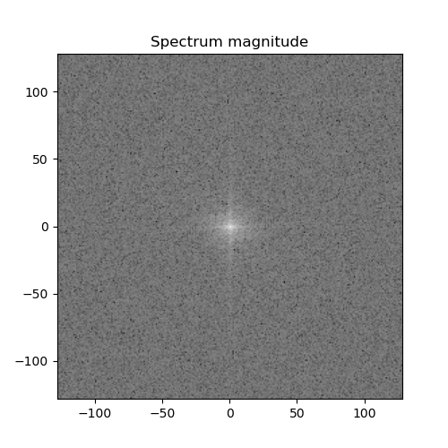

Now we can see that the low frequency components are in the center of the image.
Our next step is to zero out the components in the centre of the spectrum. This is because the low frequency components represent the smooth areas of the image and we want to preserve them. The high frequency components represent the noise and we want to remove them.

Our zeroing filter can be either Gaussian, ideal or square ideal filter.
For the size of the filtering kernel equal to 30 we get the following filters:

- Gaussian

- Ideal

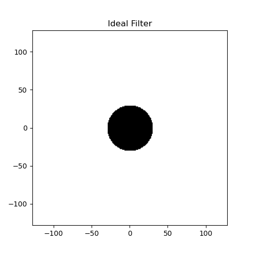

- Square ideal

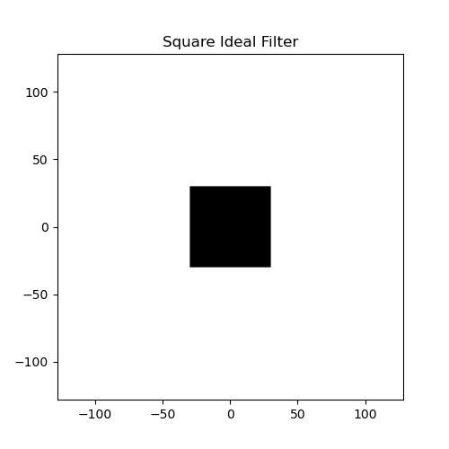

Next steps will be based on the square ideal filter. The user can set the size of the filtering kernel. The bigger the kernel, the more of the centre of the spectrum will be preserved. Then we look for peaks below the specified percentage of the maximum value of the spectrum. We shift found peaks back to align them with the original spectrum. After multiplying the original spectrum with the the mask obtained from the peaks we get the denoised image.

Now we clearly see why the use of filter is needed. We indeed preserve the low frequency components and remove the high frequency components above a certain threshold this way.

Let's say we set our threshold to 40 percentile of the maximum value of the spectrum.
The denoised image's spectrum looks like this:

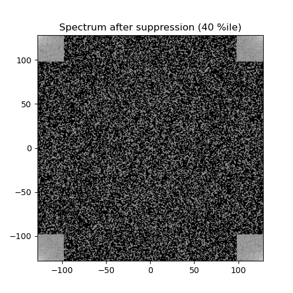

All that is left is to perform the inverse FFT transform to get the denoised image.

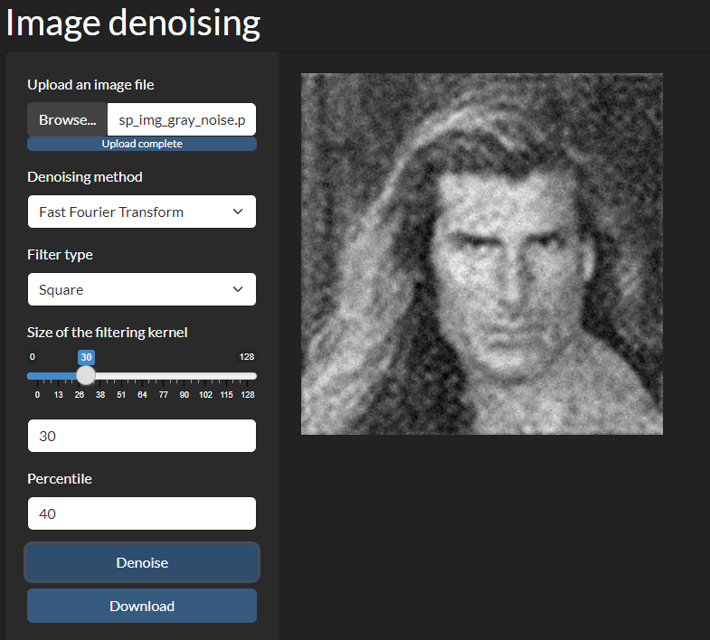

Looking at the parameters we see that user can set:

- the type of the filter
- the size of the filter
- the threshold of the filter

Increasing the size of the filter will preserve more of the low frequency components and therefore the denoised image will be more similar to the original image. Same goes for the threshold. The higher the threshold, the less of the high frequency components will be removed and the denoised image will be more similar to the original image.

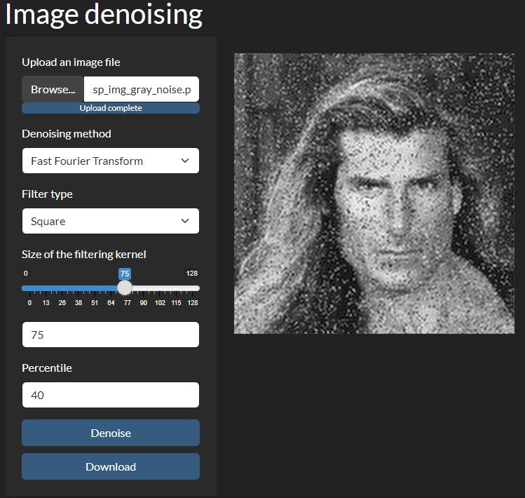

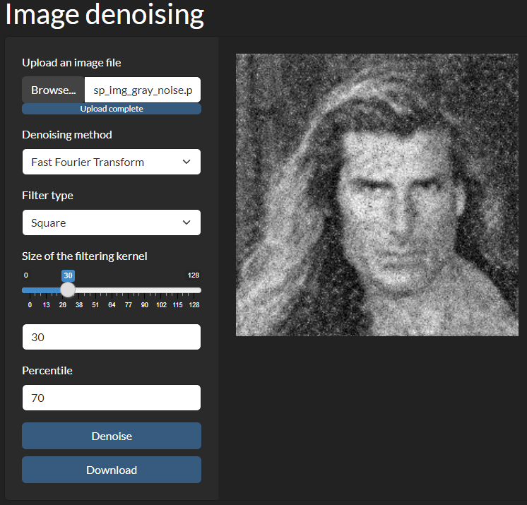

### 3.3. Wavelet

The third method we will look at is the Wavelet Transform.
During wavelet decomposition, the image is decomposed into a series of wavelet coefficients, specifically, the approximation coefficients and the detail coefficients. The approximation coefficients represent the low frequency components of the image and the detail coefficients represent the high frequency components of the image. The main point of the wavelet denoising algorithm is to remove the noise from the detail coefficients and then reconstruct the image using the approximation coefficients and the denoised detail coefficients. Therefore the wavelet denoising algorithm performs thresholding on the detail coefficients.

There are two methods of thresholding: soft and hard. The difference between the two is that the soft thresholding method sets the coefficients below the threshold to zero and the coefficients above the threshold are reduced by the threshold value. The hard thresholding method sets the coefficients below the threshold to zero and the coefficients above the threshold are left unchanged.

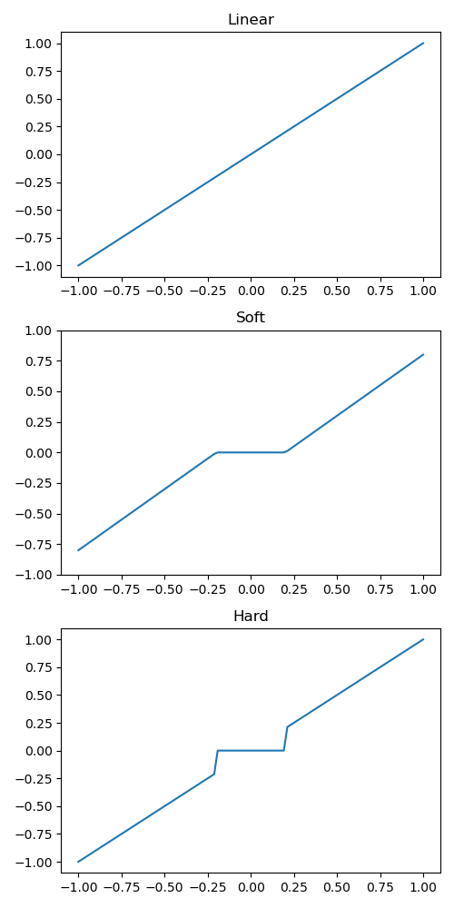

There are two implementations of methods that set the threshold value. The first one is the universal thresholding method also known as VisuShrink. The threshold value is set to the standard deviation of the noise multiplied by the square root of 2 times the logarithm of the number of coefficients. This threshold is designed to be optimal for Gaussian noise. This method tends to overestimate the noise level and the denoised image is over-smoothed. That is why we reduce the estimated standard deviation of the noise by dividing it by a specified factor. More sharpness is achieved by increasing the factor.

The second one is BayesShrink which is an adaptive thresholding method. A unique threshold is estimated for each wavelet subband. This is generally an improvement over the universal thresholding method.

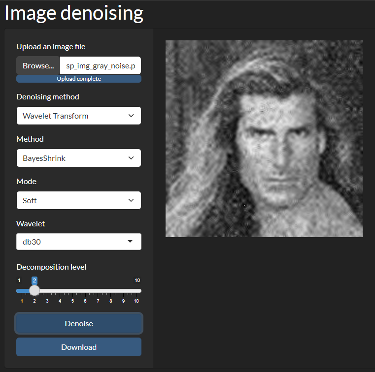

The user can set the type of the method that is used for estimating the threshold value, so it's either VisuShrink or BayesShrink. Next up we can set if we want use the soft or the hard thresholding. The wavelet parameter specifies the type of the wavelet that is used for the decomposition. The user can select any of the discrete wavelets that are available in the PyWavelets library. The level parameter specifies the level of the decomposition. The higher the level, the more detail coefficients are obtained and the more noise is removed.

For the VisuShrink method one additional parameter can be set. It's the sigma reduction factor. The higher the factor, the more the estimated standard deviation of the noise is reduced and the more sharpness is achieved.

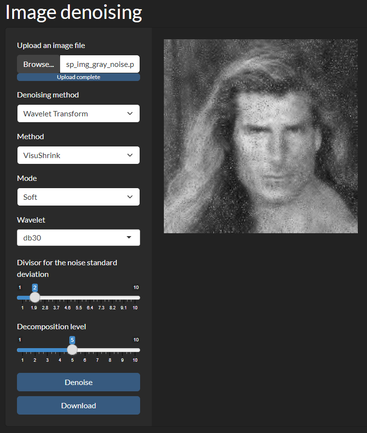

More about VisuShrink and BayesShrink can be found in the following paper: [Shivani Mupparaju, B Naga Venkata Satya Durga Jahnavi, 2013, Comparison of Various Thresholding Techniques of Image Denoising, INTERNATIONAL JOURNAL OF ENGINEERING RESEARCH & TECHNOLOGY (IJERT) Volume 02, Issue 09 (September 2013)](https://www.ijert.org/research/comparison-of-various-thresholding-techniques-of-image-denoising-IJERTV2IS90812.pdf)

### Sources

[1] [Image Denoising using Wavelet Transform in Python](https://www.youtube.com/watch?v=cidT3Or6mZU)

[2] [Scikit-image API reference](https://scikit-image.org/docs/stable/api/skimage.restoration.html#skimage.restoration.denoise_wavelet)

[3] [Scikit-image Wavelet denoising](https://scikit-image.org/docs/stable/auto_examples/filters/plot_denoise_wavelet.html)

[4] [Thomas Pietraho, Bowdoin College, Image denoising using the SVD](https://colab.research.google.com/drive/1t1PyYtfy_Vu_yX1BL8awlE3f3naiR8eo)

[5] [SciPy, Image denoising by FFT](https://scipy-lectures.org/intro/scipy/auto_examples/solutions/plot_fft_image_denoise.html)

[6] [Stackexchange, How to use 2D Fourier analysis to clean the noise in an image](https://mathematica.stackexchange.com/questions/110914/how-to-use-2d-fourier-analysis-to-clean-the-noise-in-an-image)

[7] [Craig Chen, Medium, Digital Image Processing using Fourier Transform in Python](https://hicraigchen.medium.com/digital-image-processing-using-fourier-transform-in-python-bcb49424fd82)
